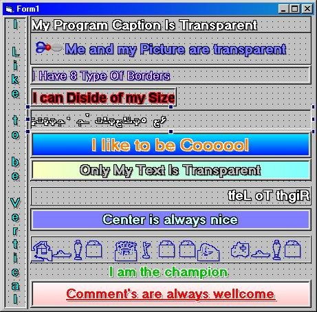



## Transparent Label

### Description

This is a Label Control But with much more properties and more nicer

Basset in the same function with the transparent container control that I post before on planet source. It is very nice. Can Display Vertical also center, right to left, can carry any picture and if the picture has the same color with the back color can be also transparent. Include all the base event’s, 8 type of border’s…

I like to have you opinion about this work. Thank.
 
### More Info
 

             |
---                |---
**Submitted On**   |2003-05-04 02:21:02
**By**             |[Toni](https://github.com/Planet-Source-Code/PSCIndex/blob/master/ByAuthor/toni.md)
**Level**          |Advanced
**User Rating**    |5.0 (25 globes from 5 users)
**Compatibility**  |VB 6\.0
**Category**       |[Custom Controls/ Forms/  Menus](https://github.com/Planet-Source-Code/PSCIndex/blob/master/ByCategory/custom-controls-forms-menus__1-4.md)
**World**          |[Visual Basic](https://github.com/Planet-Source-Code/PSCIndex/blob/master/ByWorld/visual-basic.md)
**Archive File**   |[Transparen158312542003\.zip](https://github.com/Planet-Source-Code/toni-transparent-label__1-45231/archive/master.zip)

